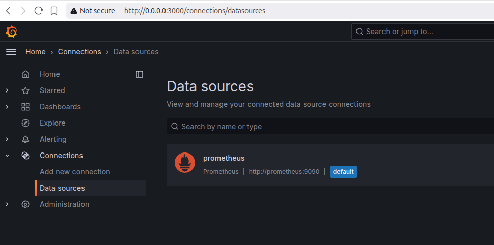
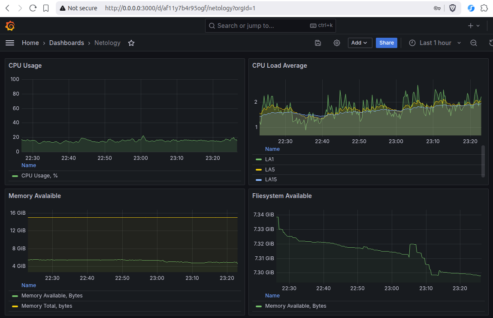
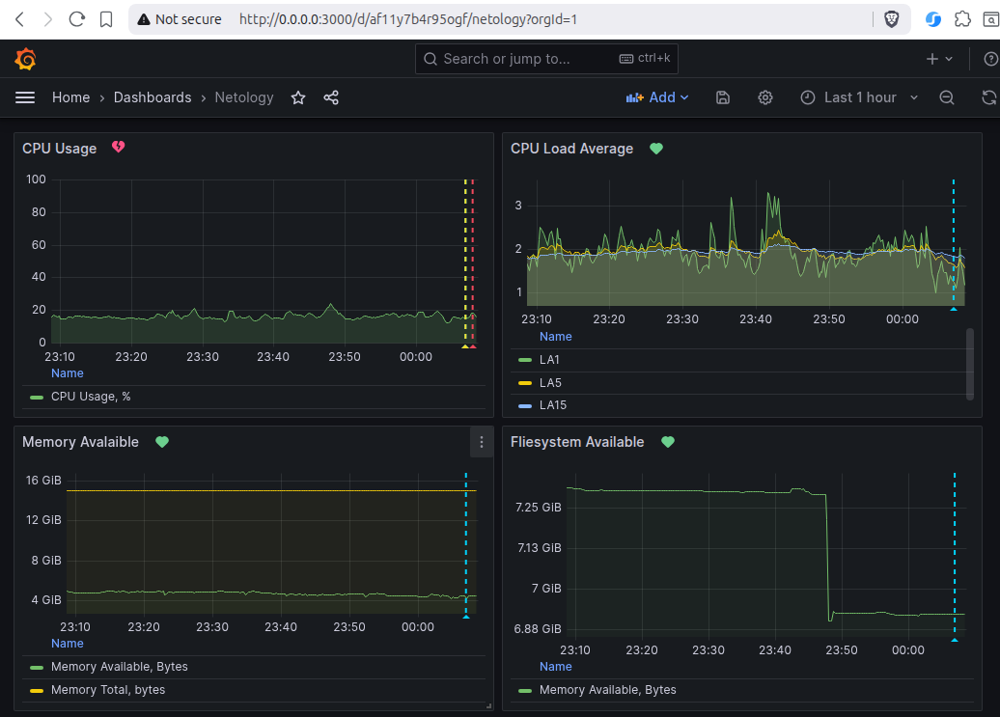
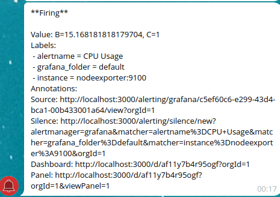

# Домашнее задание к занятию 14 «Средство визуализации Grafana»

## Задание 1

1. Используя директорию [help](./help) внутри этого домашнего задания, запустите связку prometheus-grafana.  
Ответ: [docker-compose.yml](docker-compose.yml)
1. Зайдите в веб-интерфейс grafana, используя авторизационные данные, указанные в манифесте docker-compose.
1. Подключите поднятый вами prometheus, как источник данных.
1. Решение домашнего задания — скриншот веб-интерфейса grafana со списком подключенных Datasource.


## Задание 2
Создайте Dashboard и в ней создайте Panels:
- утилизация CPU для nodeexporter (в процентах, 100-idle);  
  ```
  100-(avg by (instance)(rate(node_cpu_seconds_total{mode="idle"}[1m]))*100)
  ```
- CPULA 1/5/15;
    ```
    node_load1
    node_load5
    node_load15
    ```
- количество свободной оперативной памяти;
    ```
    node_memory_MemFree_bytes + node_memory_Cached_bytes + node_memory_Buffers_bytes + node_memory_SReclaimable_bytes
    ```
- количество места на файловой системе.
  ```
  node_filesystem_avail_bytes{instance="$node", job="$job", device!~"rootfs"}
  ```
Для решения этого задания приведите promql-запросы для выдачи этих метрик, а также скриншот получившейся Dashboard.



## Задание 3

1. Создайте для каждой Dashboard подходящее правило alert — можно обратиться к первой лекции в блоке «Мониторинг».
1. В качестве решения задания приведите скриншот вашей итоговой Dashboard.


## Задание 4

1. Сохраните ваш Dashboard. Для этого перейдите в настройки Dashboard, выберите в боковом меню «JSON MODEL». Далее скопируйте отображаемое json-содержимое в отдельный файл и сохраните его.
1. В качестве решения задания приведите листинг этого файла.  
[dashboard source](my.json)

---

### Как оформить решение задания

Выполненное домашнее задание пришлите в виде ссылки на .md-файл в вашем репозитории.

---