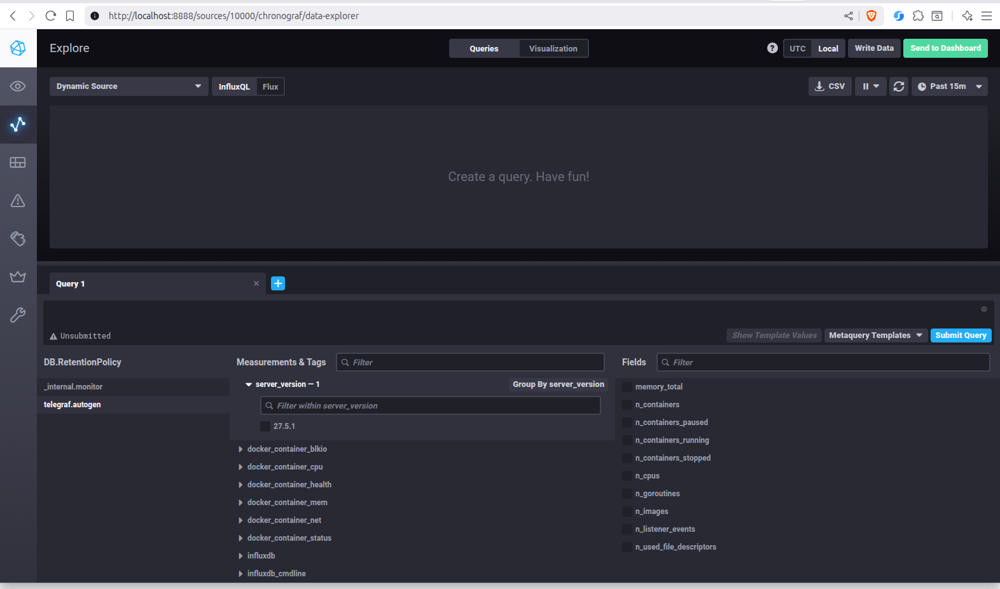

# Домашнее задание к занятию "13.Системы мониторинга"

## Обязательные задания

1. Вас пригласили настроить мониторинг на проект. На онбординге вам рассказали, что проект представляет из себя платформу для вычислений с выдачей текстовых отчётов, которые сохраняются на диск.
   Взаимодействие с платформой осуществляется по протоколу http. Также вам отметили, что вычисления загружают ЦПУ. Какой минимальный набор метрик вы выведите в мониторинг и почему?

**Ответ.**

Минимальный набор метрик:
- **Мониторинг OS**
    - CPU:
      - CPU utilization
      - CPU IOwait
      - Load Average
    - RAM:
        - Memory utilization
        - SWAP usage
    - DISK:
      -	Filesystem utilization, %, bytes
      -	Free inodes, %
      -	Disk write request avg waiting time
      -	Disk read request avg waiting time
      - Disk queue
    - NET:
      -	Interface throughput, bps
      - Interface errors

- **Мониторинг App**:
    - HTTP-запросы:
      - общее количество запросов
      -	количество ошибочных запросов (4xx, 5xx)
      -	время выполнения запросов (время отклика)

2. Менеджер продукта, посмотрев на ваши метрики, сказал, что ему непонятно, что такое RAM/inodes/CPUla. Также он сказал, что хочет понимать, насколько мы выполняем свои обязанности перед клиентами и какое качество обслуживания. Что вы можете ему предложить?

**Ответ.**

- **RAM** – оперативная память
- **Inodes** - индексные дескрипторы. Их нехватка приведет к ошибке создания файла, даже если Filesystem utilization еще не 100%, актуально для ext4
- **CPU LA** - показатель нагрузки системы в целом, и ядер CPU в частности

Свяжем тех. метрики с бизнес-составляющей: SLO SLA SLI  
- **SLA** - Если клиент не получил ожидаемый ответ от приложения, то бизнес несет убытки. Гарантируем, что ожидаемый ответ от приложения составляет не более 5 секунд  
- **SLO** - Если мы заявляем, что 99% пользователей получат в нужный срок ожидаемый ответ от приложения. 1% - техническое обслуживание  
- **SLI** : Расчет по ответу от приложения клиенту  
  *Успех*: Запрос должен отдавать `2xx` или `3xx` коды в течение `5` секунд  
  *Неудача*: нарушение любого условия (ответ или время)
```
SLI = (summ_2xx_requests_less_than_5_sec + summ_3xx_requests_less_than_5_sec) / (summ_all_requests)
```

3. Вашей DevOps-команде в этом году не выделили финансирование на построение системы сбора логов. Разработчики, в свою очередь, хотят видеть все ошибки, которые выдают их приложения. Какое решение вы можете предпринять в этой ситуации, чтобы разработчики получали ошибки приложения?

**Ответ.**  
Можно отправлять логи в Loki через docker plugin. В графане настроить алертинг. Вот мануал https://grafana.com/tutorials/create-alerts-with-logs/.  
Не в docker сейчас трудно представить развертывания.

4. Вы, как опытный SRE, сделали мониторинг, куда вывели отображения выполнения SLA = 99% по http-кодам ответов.
   Этот параметр вычисляется по формуле: summ_2xx_requests/summ_all_requests. Он не поднимается выше 70%, но при этом в вашей системе нет кодов ответа 5xx и 4xx. Где у вас ошибка?

**Ответ.**

Формула не верная, так как корректный ответ может быть не только `2xx`, но и `1xx` и `3xx`
- Правильная формула:
```
(summ_1xx_requests + summ_2xx_requests + summ_3xx_requests)/summ_all_requests
```

5. Опишите основные плюсы и минусы pull и push систем мониторинга.

**Ответ.**

- **Push**
    - Плюсы:
        - Удобно использовать когда собирается большое количество метрик и неустойчивый канал связи между агентами и системой мониторинга.
        - Можно переключать передачу данных между udp и tcp, тем самым выбирая между экономией трафика или гарантией доставки.
        - Гибкая настройка частоты и объёма передаваемых метрик.
        - Можно использовать в динамически меняющемся окружении (метрики с агентов сами будут поступать в систему мониторинга без её дополнительной настройки)
        - Когда система мониторинга централизованная, а контура с приложениями напрямую недоступны снаружи 
- **Pull**
    - Плюсы:
        - Позволяет контролировать источники откуда принимать метрики.
        - Можно защитить канал связи между агентами и системой мониторинга шифрованием.
        - Упрощённая отладка получения метрик с агентов.
    - Минусы:
        - К минусам можно отнести сложность мониторинга динамически изменяющегося окружения

6. Какие из ниже перечисленных систем относятся к push модели, а какие к pull? А может есть гибридные?

**Ответ.**

- **Prometheus** - Можно отправлять метрики по `push` модели при помощи `push gateway`, но Prometheus будет из забирать как `pull`
- **TICK** - `push`
- **Zabbix** - Оба варианта `push` и `pull`
- **VictoriaMetrics** - `push`
- **Nagios** - `pull`

7. Склонируйте себе [репозиторий](https://github.com/influxdata/sandbox/tree/master) и запустите TICK-стэк,
   используя технологии docker и docker-compose.

В виде решения на это упражнение приведите скриншот веб-интерфейса ПО chronograf (`http://localhost:8888`).

P.S.: если при запуске некоторые контейнеры будут падать с ошибкой - проставьте им режим `Z`, например
`./data:/var/lib:Z`

**Ответ.**


8. Перейдите в веб-интерфейс Chronograf (http://localhost:8888) и откройте вкладку Data explorer.

    - Нажмите на кнопку Add a query
    - Изучите вывод интерфейса и выберите БД telegraf.autogen
    - В `measurments` выберите cpu->host->telegraf-getting-started, а в `fields` выберите usage_system. Внизу появится график утилизации cpu.
    - Вверху вы можете увидеть запрос, аналогичный SQL-синтаксису. Поэкспериментируйте с запросом, попробуйте изменить группировку и интервал наблюдений.

Для выполнения задания приведите скриншот с отображением метрик утилизации cpu из веб-интерфейса.

**Ответ.**


9. Изучите список [telegraf inputs](https://github.com/influxdata/telegraf/tree/master/plugins/inputs).
   Добавьте в конфигурацию telegraf следующий плагин - [docker](https://github.com/influxdata/telegraf/tree/master/plugins/inputs/docker):
```
[[inputs.docker]]
  endpoint = "unix:///var/run/docker.sock"
```
После настройке перезапустите telegraf, обновите веб интерфейс и приведите скриншотом список `measurments` в
веб-интерфейсе базы telegraf.autogen . Там должны появиться метрики, связанные с docker.

**Ответ.**  
Рабочий конфиг:
```yaml
  telegraf:
    image: "telegraf"
    privileged: true
    user: 0:133
    environment:
      HOSTNAME: "telegraf-getting-started"
    links:
      - influxdb
    volumes:
      - ./telegraf/:/etc/telegraf:Z
      - /var/run/docker.sock:/var/run/docker.sock:Z
    depends_on:
      - influxdb
```

